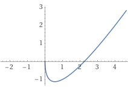

# Partie B - Problème 2 (21 points)

## Réponses
### a)
$s(4) \approx \frac{69}{48}$

### b)
$s'(1+h) = y'_1 = \frac{5h+2}{4h+4}$ et $s(1+2h) = y_2 = \frac{7h^2-4}{4h+4}$

### c)
$x = 1+\frac{4\sqrt{7}}{7}$ est une approximation d'un zéro de $s$.

### d)
On a une tangente horizontale environ au point $P_T(\frac{3}{5}; -\frac{6}{5})$

### e)
La solution générale est :
$y = 2x + C \sqrt{x}$
où C est une constante dépendante des conditions initiales.

### f)
$s(x) = 2x -3\sqrt{x}$

### g)
Les zéros de $s(x)$ sont à $x \in \{0;\frac{9}{4}\}$

Et le point à tangente horizontale est $P_{Th}(\frac{9}{16}; -\frac{9}{8})$

## Résolutions détaillées
### a)
Pour la solution considérée $s$, comme le graphe passe par $P(1;-1)$, nous avons donc $x_0 = 1$ et $y_0 = -1$. La méthode d'Euler[^B21] nous permet d'évaluer $x_{n+1}$ et $y_{n+1}$ avec:

$x_{n+1} = x_{n} + h$

$y_{n+1} = y_{n} + h y'_{n}$

On remplit le tableau suivant de facon itérative en utilisant $y'_n = \frac{y_n}{2x_n} + 1$ jusqu'à obtenir la valeur de $y_n$ pour $x_n = 4$ avec $h = 1$

| $n$  | $x_n$ | $y_n$           | $y'_n$          |
| ---- | ----- | --------------- | --------------- |
| $0$  | $1$   | $-1$            | $\frac{1}{2}$   |
| $1$  | $2$   | $-\frac{1}{2}$  | $\frac{7}{8}$   |
| $2$  | $3$   | $\frac{3}{8}$   | $\frac{51}{48}$ |
| $3$  | $4$   | $\frac{69}{48}$ |                 |

Donc $s(4) \approx \frac{69}{48}$

### b)
De facon similaire en remplacant le pas par $h$, on obtient:

| $n$  | $x_n$ | $y_n$                 | $y'_n$              |
| ---- | ----- | --------------------- | ------------------- |
| $0$  | $1$   | $-1$                  | $\frac{1}{2}$       |
| $1$  | $1+h$ | $-1 + \frac{1}{2}h$   | $\frac{5h+2}{4h+4}$ |
| $2$  | $1+2h$| $\frac{7h^2-4}{4h+4}$ |                     |

On déduit du tableau que $s'(1+h) = y'_1 = \frac{5h+2}{4h+4}$ et $s(1+2h) = y_2 = \frac{7h^2-4}{4h+4}$

### c)
On pose 

$s(1+2h) = 0 \rightarrow \frac{7h^2 - 4}{4h + 4} = 0 \rightarrow 7h^2 - 4 = 0 \rightarrow h = \sqrt{\frac{4}{7}} = \frac{2\sqrt{7}}{7}$

Donc $x = 1+2h = 1+\frac{4\sqrt{7}}{7}$ est une approximation d'un zéro de $s$.

### d)
On pose

$s'(1+h) = 0 \rightarrow \frac{5h+2}{4h+4} = 0\rightarrow 5h + 2 = 0 \rightarrow h = -\frac{2}{5}$

Le point qu'on cherche correspond à $P_T(x_1; y_1)$, d'après le tableau du point c), nous obtenons

$x_1 = 1 + h = 1 - \frac{2}{5} = \frac{3}{5}$

$y_1 = -1 + \frac{1}{2}h = -\frac{6}{5}$

donc on a une tangente horizontale environ au point $P_T(\frac{3}{5}; -\frac{6}{5})$

### e)
On réécrit l'équation différentielle linéaire dans la forme standard $y' + p(x)y = q(x)$

$y' - \frac{1}{2x}y = 1$

On calcule le facteur d'intégration $\mu = e^{\int{p(x)dx}}$

$\mu = e^{\int{-\frac{1}{2x}}dx} = e^{-\frac{1}{2}ln|x|} = \frac{1}{\sqrt{x}}$

Ce qui nous permet de poser et résoudre pour y $\mu y = \int{\mu q(x)dx}$

$\frac{1}{\sqrt{x}}y = \int{\frac{1}{\sqrt{x}}\cdot 1 dx} = 2 \sqrt{x} + C$

Donc la solution générale est :

$y = 2x + C \sqrt{x}$

où C est une constante dépendante des conditions initiales.

### f)
On cherche maintenant la solution particulière avec comme conditions initiales $y(1) = -1$, il nous suffit donc de remplacer dans la solution générale:

$y = 2x + C \sqrt{x} \rightarrow -1 = 2 + C \rightarrow C = -3$

On obtient donc bien la solution particulière $s(x) = 2x -3\sqrt{x}$

### g)
Pour trouver les zéros, on pose $s(x) = 0$

$s(x) = 2x - 3\sqrt{x} = 0 \rightarrow \sqrt{x}(2\sqrt{x} - 3) = 0$

On a donc un premier zéro quand $\sqrt{x} = 0 \rightarrow x = 0$

Et un deuxième quand $2\sqrt{x} - 3 = 0 \rightarrow x = \frac{9}{4}$

Pour trouver le point à tangente horizontale, il faut poser $s'(x) = 0$:

$s'(x) = 2 - \frac{3}{2\sqrt{x}} = 0 \rightarrow x = \frac{9}{16}$

Il nous faut maintenant trouver la coordonnée $y$ de ce point:
$y(\frac{9}{16}) = -\frac{9}{8}$

Donc les zéros de $s(x)$ sont à $x \in \{0;\frac{9}{4}\}$

Et le point à tangente horizontale est $P_{Th}(\frac{9}{16}; -\frac{9}{8})$

{ width=33% }

[^B21]: Algorithme d'Euler, Formulaires et Tables, Edition 2018, p.101 

